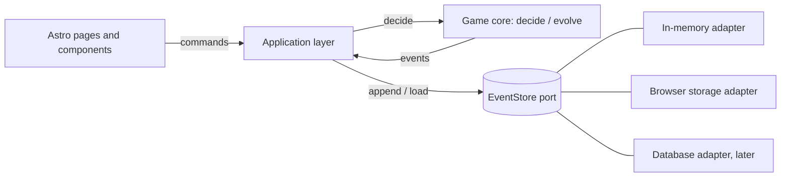

# Architecture

Status: **proposed** (2026-10-07). Decisions are recorded in the ADRs linked below.

The site is an Astro app. The interesting part is the **game core** in
`src/lib/`: a framework-free TypeScript library that models a board-game match as
an event log. Everything else (pages, storage, deployment) depends on the core,
never the other way round.

## Goals

- Logic that is easy to change safely: pure functions, strong types, fast tests.
- A history of every match that can be replayed, audited and undone.
- Rules that are data and plug-ins, so Catan variants and other board games fit.
- A workflow in which the architecture defends itself (checks run in CI).

## Overview



## The core: decide and evolve

Two pure functions per game module (the "decider" pattern):

```ts
decide(state: State, command: Command): Result<Event[], RuleViolation>
evolve(state: State, event: Event): State
```

- A **command** is a request ("upgrade Ana's settlement"). `decide` checks it
  against the rules and returns events or a rule violation. It never mutates.
- An **event** is a fact that already happened ("SettlementUpgraded, Ana").
  Events are stored; they are never edited.
- `state = events.reduce(evolve, initialState)`. Scores, award holders and the
  winner are all derived, never stored.

Consequences: undo is "drop the last event", replay is a fold, and every rule is
testable as Given (events) / When (command) / Then (events or violation), which
is the BDD style the project already uses.

### Catan module (first game)

| Concept | Detail |
| --- | --- |
| Events | `GameStarted`, `SettlementBuilt`, `SettlementUpgraded`, `VictoryPointCardRevealed`, `KnightPlayed`, `RoadLengthRecorded` |
| Base VP | settlement 1, city 2, VP card 1 |
| Awards | Largest Army (3 knights) and Longest Road (5 segments), 2 VP each, one generic resolver |
| Award rules | transfers only on strict exceedance; a tie keeps the incumbent; an incumbent who falls below the threshold loses it |
| Winner | first player at 10 VP or more; otherwise the game is `incomplete` |

The tracker records what players report (for example road length). It does not
simulate the board.

## Layers and dependency rules

1. `src/lib/core` and `src/lib/games/*`: pure domain code. May import nothing
   from Astro, the DOM, Node APIs or other layers.
2. `src/lib/app`: orchestration (load events, call `decide`, append). Depends on
   the core and on the `EventStore` interface only.
3. `src/lib/adapters`: implementations of ports (in-memory, browser storage).
4. `src/pages`, `src/components`: delivery. May depend on `app`.

Dependencies point inward. These rules are enforced in CI (see ADR-004).

## Extension points

- **Game modules:** a `GameModule<State, Command, Event>` bundle of `initial`,
  `decide`, `evolve` and `score`. Adding a game or variant means a new module,
  not changes to the core.
- **Storage:** new adapters implement `EventStore`.
- **Projections:** statistics (win rates, history) are extra folds over the same
  events.

## Verification strategy

Example tests (BDD), property-based tests, mutation testing and architecture
rules, all gated in CI. See [ADR-005](adr/ADR-005-verification-strategy.md).

## Decisions

- [ADR-002](adr/ADR-002-gitflow-branching-model.md): GitFlow branching model
- [ADR-003](adr/ADR-003-event-sourced-game-core.md): event-sourced game core
- [ADR-004](adr/ADR-004-layered-architecture-and-dependency-rules.md): layers and enforced dependency rules
- [ADR-005](adr/ADR-005-verification-strategy.md): verification strategy
